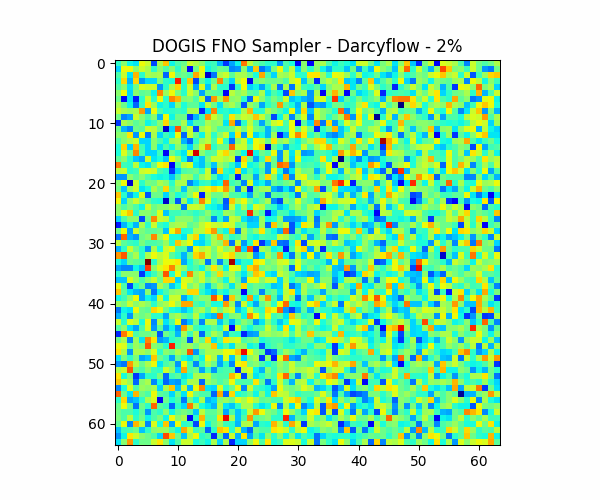
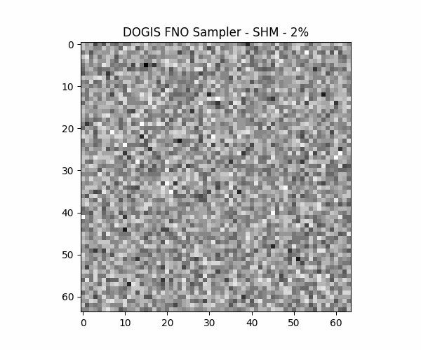
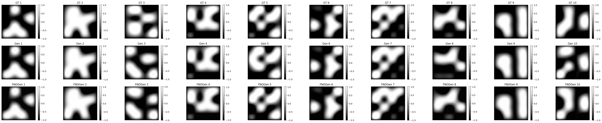

# 🌌 Dynamic Operator-Guided Flow Matching: A Generative Physical Inverse Solver for Arbitrary Sparse Observations

**A Generative Physical Inverse Solver for Arbitrary Sparse Observations**

<table>
  <tr>
    <td align="center">
      
      <br>
      <em>DOGIS: Darcy Flow</em>
    </td>
    <td align="center">
      
      <br>
      <em>DOGIS: Structural Health Monitoring</em>
    </td>
  </tr>
</table>

> This repository contains the official PyTorch implementation of **DOGIS**, a generative framework designed to solve severely ill-posed inverse problems under extreme data sparsity and high noise regimes.

## 📖 Overview

Solving ill-posed inverse problems—inversing high-dimensional, heterogeneous physical fields from limited observations—is a fundamental challenge in scientific engineering. Traditional solvers are computationally prohibitive, while recent deep learning approaches (e.g., Diffusion Posterior Sampling) suffer from catastrophic posterior collapse and significant inference latency when physical gradients become ill-conditioned under extreme sparsity.

**DOGIS** overcomes this bottleneck by paradigm-shifting the computational burden from test-time optimization to amortized training. By explicitly embedding a pre-trained Fourier Neural Operator (FNO) into the continuous normalizing flow trajectory, DOGIS successfully internalizes complex PDE dynamics into the generative prior itself. 




### 🔥 Key Highlights
* **Extreme Sparsity Robustness:** Exhibits graceful degradation under severe sparsity, successfully recovering $64 \times 64$ resolution fields from merely 16 random sensors (an extreme 0.78% sparsity).
* **Ultra-Fast Inference:** Achieves an average 8x inference speedup over standard DPS frameworks.
* **Physics-Aware UQ:** Provides precise, physics-aware Uncertainty Quantification (UQ) that isolates high-variance regions to genuinely ambiguous topological boundaries, avoiding uninformative variance inflation.
* **Continuous Data Assimilation:** The time-adaptive weighting scheduling $\lambda(t)$ is mathematically equivalent to the continuous-time limit of covariance inflation in Ensemble Smoother with Multiple Data Assimilation (ES-MDA).

## ⚙️ Core Architecture & Inference Modes

DOGIS provides a highly flexible hybrid inference paradigm, allowing users to dynamically balance computational latency and physical precision:

1. **Agile Mode (Amortized Zero-Shot Inference):** Executes an amortized inference path using Classifier-Free Guidance (CFG) for real-time decision-making and large-scale UQ sampling.
2. **Guided Mode (Test-Time Physics Guidance):** Performs a continuous manifold projection. During the later stages of integration (e.g., $t \ge 0.5$), the exact automatic differentiation of the FNO surrogate is leveraged to compute the steepest-descent direction, continuously pulling the trajectory towards the precise sparse data manifold.

## 🛠️ Installation

Clone the repository and install the required dependencies:

```bash
git clone [https://github.com/RaphaelYangWJ/DOGIS.git](https://github.com/RaphaelYangWJ/DOGIS.git)
cd DOGIS
pip install -r requirements.txt
```
*(Ensure you have a CUDA-compatible PyTorch version installed).*

## 🚀 Quick Start & Evaluation

The repository evaluates DOGIS on two highly heterogeneous physical scenarios:
1. **Darcy Flow:** Subsurface fluid transport governed by second-order elliptic PDEs (permeability field inversion).
2. **Structural Health Monitoring (SHM):** Mechanical behaviors governed by elastodynamic equations mapping spatially heterogeneous elastic properties (Young's modulus inversion).

## 📂 Repository Structure

```text
DOGIS/
├── data/                  # Data loaders and dataset handling
├── models/                # Core architectures (FlowMatching, FNO)
├── scripts/               # Training and evaluation scripts
├── notebooks/             # UQ, 3D visualizations, and video generation
├── requirements.txt       # Dependencies
└── README.md
```


